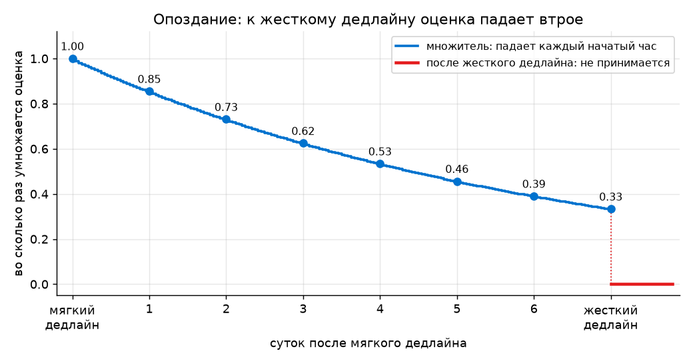

# Оценивание

Курс годичный. Этот документ описывает правила **первого семестра**.
Итоговая оценка по 10-балльной шкале.

## Формула

```
Итог = 0.4 × Домашние работы
     + 0.3 × Лабораторные
     + 0.3 × Устный ответ на зачете
```

Все три составляющие оцениваются по 10-балльной шкале. Результат
округляется до целого и обрезается в диапазон 0…10. Порог сдачи — 4 балла.

Одно жесткое условие. Если не сдана **ни одна** домашняя работа, курс
не сдан независимо от всего остального, и на зачет можно не приходить.
Домашки — это и есть курс, устный ответ только проверяет, что вы понимаете,
что делали.

## Домашние работы: 40% оценки

За семестр три большие работы. Каждая оценивается по 10-балльной шкале,
и сверху можно получить до 3 баллов за свою гипотезу: максимум 13 из 10.
Итоговая оценка за блок — среднее арифметическое трех.

Из чего складывается оценка за работу:

| Что | Баллов |
|:--|--:|
| Обязательная часть выполнена, результат воспроизводится | 5 |
| Метрики и валидация: метрики выбраны под задачу и объяснено почему, схема разбиения обоснована, модели выбраны кросс-валидацией, а тестовый сет использован один раз | 3 |
| Разбор собственных ошибок и неудавшихся попыток | 2 |
| Своя гипотеза, проверенная экспериментом: балл зависит от того, насколько идея интересная и насколько аккуратно она проверена | от +1 до +3 |

Работа, которая не запускается или не воспроизводит заявленный результат,
получает 0 независимо от объема написанного.

### Дедлайны

У каждой работы мягкий и жесткий дедлайн. Жесткий дедлайн предыдущей работы
совпадает с днем выдачи следующей — так вы не тащите хвост в новую тему.

| Работа | Выдана | Мягкий дедлайн | Жесткий дедлайн |
|:--|:--|:--|:--|
| HW1. Диалоги с языковыми моделями: реакция пользователя и темы | 26.09 | 17.10 | 24.10, в день выдачи HW2 |
| HW2. Генератор стихов по первой строке | 24.10 | 14.11 | 21.11, в день выдачи HW3 |
| HW3. Тема объявляется при выдаче | 21.11 | 12.12 | 19.12, на зачете |

До мягкого дедлайна работа оценивается полностью. После него оценка падает
экспоненциально, каждый начатый час, и к жесткому дедлайну становится втрое
меньше. Если между дедлайнами $H$ часов, а работа опоздала на $h$ начатых
часов, оценка умножается на

$$k(h) = 3^{-h/H}.$$

При $h = 0$ множитель равен 1, в момент жесткого дедлайна — $\frac{1}{3}$.
Между мягким и жестким дедлайном неделя, $H = 168$: за каждый час множитель
умножается на $3^{-1/168} \approx 0.9935$, за сутки — примерно на 0.85.

| Опоздание, суток | 0 | 1 | 2 | 3 | 4 | 5 | 6 | 7, жесткий дедлайн |
|:--|--:|--:|--:|--:|--:|--:|--:|--:|
| Множитель оценки | 1 | 0.85 | 0.73 | 0.62 | 0.53 | 0.46 | 0.39 | 0.33 |



После жесткого дедлайна работа не принимается, ставится 0.

Заболели, завал на другом предмете, аврал на работе — напишите **до** дедлайна.
Сдвину. Молчание до дедлайна и объяснение после — нет.

## Лабораторные: 30% оценки

После каждого семинара остается ноутбук с задачами. Всего за семестр
четырнадцать таких ноутбуков.

В каждом ноутбуке есть открытые проверочные ячейки: запустили — сразу видно,
работает ваш код или нет. Присланные ноутбуки я прогоняю через автоматическую
систему, которая проверяет ваши функции еще и на закрытом наборе тестов,
более широком, чем открытый.

Каждый ноутбук дает от 0 до 10 баллов за обязательные задачи и до балла
сверху за каждую решенную бонусную. Итог за ноутбук округляется до целого
вниз и не больше 11. Оценка за блок — среднее по всем
четырнадцати. Ноутбук, который вы не присылали, считается нулем.

Вместе с оценкой вы получаете отчет: какие тесты прошли, какие упали,
с каким сообщением, и сколько баллов снято за что. Отчет нужен, чтобы вы
понимали причину, а не гадали.

Не успели на паре — дорешайте и пришлите до следующего занятия, зачтется
полностью. Смысл лабораторной в том, чтобы вы разобрались, а не в том,
чтобы уложились в полтора часа.

## Устный ответ: 30% оценки

Зачет устный, по программе, которая будет выложена в ноябре. Спрашиваю
по темам курса и по вашим же домашним работам.

## Домашку можно закрыть своей работой

Если вы уже делаете что-то по теме курса всерьез, изобретать велосипед
второй раз незачем. Домашняя работа засчитывается вашей настоящей работой,
если она сопоставима по содержанию.

Что подходит:

- участие в соревновании по машинному обучению или хакатоне, любая площадка
- рабочие или стажерские задачи, если по ним можно что-то показать
- собственный проект или научная работа, где есть данные и измеримый результат
- курсовая или диплом, если тема пересекается

Что нужно, чтобы это зачлось: прийти **до дедлайна** и договориться заранее,
а потом защитить так же, как обычную домашку — рассказать, откуда данные,
как устроена проверка, почему выбрана эта метрика, где решение ломается.

Замена засчитывается за ту работу, которой соответствует по смыслу.
Соревнование с готовым датасетом не закрывает первую работу: она
проверяется на скрытом тесте курса. Вторую или третью закрыть можно.
Сомневаетесь — спросите.

## Работать вместе можно

Домашки разрешается делать командой до четырех человек. Главное, чтобы
каждый в команде знал, как и где все работает, и мог объяснить
и воспроизвести любую часть работы.

- состав команды объявляется заранее, а не в момент сдачи
- защищаетесь вместе, вопрос может достаться любому по любой части работы
- в отчете написано, кто что делал
- оценка на всю команду одна

Если на защите выясняется, что один человек не понимает, что происходит
в работе, снижается оценка всей команде.

Обсуждать задачи с другими командами можно. Сдавать чужой код как свой —
нет: две одинаковые работы получают 0 обе, без разбирательств о том,
кто у кого взял.

## Посещаемость

Не влияет на оценку, но я ее веду и я вас запомню.

## Пример

Студент сдал три домашки на 8, 6 и 9. Средняя 7.67.
Прислал 11 ноутбуков из 14, средний балл по всем четырнадцати 6.4.
Устный ответ на 7.

```
0.4 × 7.67 + 0.3 × 6.4 + 0.3 × 7 = 3.07 + 1.92 + 2.1 = 7.09  ->  7
```
